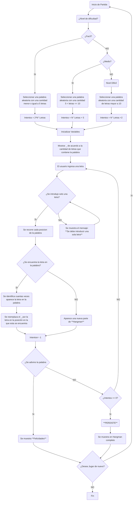

# Proyecto_Programacion
> - Rafael David Martínez Ovallos
> - Dania Lorena Pérez Moreno

[](https://postimg.cc/vxdRRg4S)
### Amplia tu léxico jugando
A continuación te presentaremos un poco acerca del desarrollo de un juego que te puede teletransportar a tu infancia, aquella epoca en la que jugabas con tus amigos y compañeros del colegio. Esos juegos como serpiente, congelados, Stop, sopa de letras ... **Ahorcado**.
## ¿En que consiste el juego de Ahorcado?
| AHORCADO|
| ----------- |
| **Ahorcado** o Hangman es una juego que consiste en adivinar una palabra al azar, la manera en la cual se desarrolla es una determinado numero de rayas al piso **_** de acuerdo a la cantidad de letras de la plaabra, posterior el jugador sugiere una letra, si esta letra está dentro de la palabra se sustiye el guión en la posicion de la letra por la misma, esto se repite hasta que se adivine por completo la palabra o se acaben la cantidad de intentos |


## Diagrama de Flujo
A continuación se muestra el diagrama que se va a seguir para el desarrollo e implementación de los diferentes procesos que se deben de tener en cuenta para cumplir con el objetivo planteado.

### Código Base

EL codigo base para que funcione el ahorcado es el siguiente
```python
import random
import time
if __name__ == "__main__":
    lista = ["palabra","comida","carne","cerdo","juegos","arroz"]
    palabra : str = random.choice(lista)
    ahorcado : str = "_" * len(palabra)
    errores : int = 0
    inicio : float = time.time()
    while errores < 7 :
        letra : str = str(input("Dijite un letra: "))
        if letra in palabra:
            for i in range(len(palabra)):
                if palabra[i] == letra:
                    ahorcado = ahorcado[:i] + letra + ahorcado[i+1:]
            print(ahorcado)
            if ahorcado == palabra:
                print(f'Felicidades ganaste')
                break
        else:
            errores += 1
            if errores == 1:
                print(f'Tienes {errores} error.')
            else:
                print(f'Tienes {errores} errores.')
    if errores == 7:  
        print(f'Mejor Suerte la proxima, la palabra es [{palabra}]')
    fin : float = time.time()
    print(f'Gracias por jugar')
    print(f'Tiempo de juego: {(fin - inicio)} segundos')

```
Este codigo es el que permite que el ahorcado funcione con lo que solamente sería agregarle las opciones de dificultad y otras alternativas extras para jugar.

### Librerías a utilizar
- Random
- Time
- Thinker

| RANDOM|
| ----------- |
|Ofrece generadores de números pseudo-aleatorios para varias distribuciones |

| TIME|
| ----------- |
| **Ahorcado** o Hangman es una juego que consiste en adivinar una palabra al azar, la manera en la cual se desarrolla es una determinado numero de rayas al piso **_** de acuerdo a la cantidad de letras de la plaabra, posterior el jugador sugiere una letra, si esta letra está dentro de la palabra se sustiye el guión en la posicion de la letra por la misma, esto se repite hasta que se adivine por completo la palabra o se acaben la cantidad de intentos |

| THINKER|
| ----------- |
| **Ahorcado** o Hangman es una juego que consiste en adivinar una palabra al azar, la manera en la cual se desarrolla es una determinado numero de rayas al piso **_** de acuerdo a la cantidad de letras de la plaabra, posterior el jugador sugiere una letra, si esta letra está dentro de la palabra se sustiye el guión en la posicion de la letra por la misma, esto se repite hasta que se adivine por completo la palabra o se acaben la cantidad de intentos |
