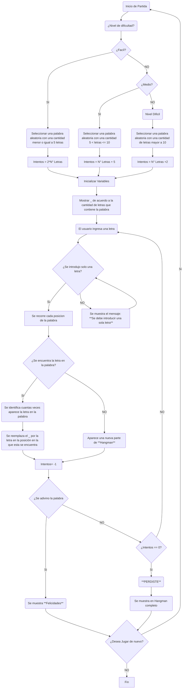

# Proyecto_Programacion
> - Rafael David Martínez Ovallos
> - Dania Lorena Pérez Moreno

[](https://postimg.cc/vxdRRg4S)
### Amplia tu léxico jugando
A continuación te presentaremos un poco acerca del desarrollo de un juego que te puede teletransportar a tu infancia, aquella epoca en la que jugabas con tus amigos y compañeros del colegio. Esos juegos como serpiente, congelados, Stop, sopa de letras ... **Ahorcado**.
## ¿En que consiste el juego de Ahorcado?
| AHORCADO|
| ----------- |
| **Ahorcado** o Hangman es una juego que consiste en adivinar una palabra al azar, la manera en la cual se desarrolla es una determinado numero de rayas al piso **_** de acuerdo a la cantidad de letras de la plaabra, posterior el jugador sugiere una letra, si esta letra está dentro de la palabra se sustiye el guión en la posicion de la letra por la misma, esto se repite hasta que se adivine por completo la palabra o se acaben la cantidad de intentos |


## Diagrama de Flujo
A continuación se muestra el diagrama que se va a seguir para el desarrollo e implementación de los diferentes procesos que se deben de tener en cuenta para cumplir con el objetivo planteado.

### Código Base

EL codigo base para que funcione el ahorcado es el siguiente
```python
import random
import time
if __name__ == "__main__":
    lista = ["palabra","comida","carne","cerdo","juegos","arroz"]
    palabra : str = random.choice(lista)
    ahorcado : str = "_" * len(palabra)
    errores : int = 0
    inicio : float = time.time()
    while errores < 7 :
        letra : str = str(input("Dijite un letra: "))
        if letra in palabra:
            for i in range(len(palabra)):
                if palabra[i] == letra:
                    ahorcado = ahorcado[:i] + letra + ahorcado[i+1:]
            print(ahorcado)
            if ahorcado == palabra:
                print(f'Felicidades ganaste')
                break
        else:
            errores += 1
            if errores == 1:
                print(f'Tienes {errores} error.')
            else:
                print(f'Tienes {errores} errores.')
    if errores == 7:  
        print(f'Mejor Suerte la proxima, la palabra es [{palabra}]')
    fin : float = time.time()
    print(f'Gracias por jugar')
    print(f'Tiempo de juego: {(fin - inicio)} segundos')

```
Este codigo es el que permite que el ahorcado funcione con lo que solamente sería agregarle las opciones de dificultad y otras alternativas extras para jugar.

### Librerías a utilizar
| RANDOM|
| ----------- |
|Ofrece generadores de números pseudo-aleatorios para varias distribuciones.Un generador de números aleatorios es un objeto que crea una secuencia de valores seudoaleatorios. Un generador que crea valores distribuidos uniformemente en un rango especificado es un generador de números aleatorios uniformes (URNG). |

| TIME|
| ----------- |
|Proporciona un conjunto de funciones para trabajar con fechas y/o horas. Además de estás funciones hay otras relacionadas en los módulos datetime y calendar que conviene conocer|

| THINKER|
| ----------- |
|Es una librería del lenguaje de programación Python y funciona para la creación y el desarrollo de aplicaciones de escritorio. Esta librería facilita el posicionamiento y desarrollo de una interfaz gráfica de escritorio con Python.|

### Funciones que se tendran en cuenta
#### Def generar palabra
De utiliza la libreria **random.choice**, la cual devuelve un valor aleatorio extraído de la secuencia pasada como argumento
```python
def generar_palabra (nivel : int ):
    if nivel == 1:
        nivel_facil = [
    "agua", "amor", "ancho", "arte", "avión", "bajo", "barco", "bebé", "boca", "bola", "brazo", "burro", "calle", "cama", "casa", "cielo", "cine", "clima", "coche", "codo",
    "cola", "conejo", "copa", "cubo", "dedo", "días", "dios", "duda", "duro", "eco", "edad", "elba", "enano", "esos", "este", "éter", "fama", "faro", "fiar", "fiel",
    "flor", "frío", "gato", "giro", "goma", "hilo", "hombre", "hoja", "hora", "hueso", "idea", "iglesia", "imán", "iso", "jugo", "juez", "lago", "lana", "lata", "león",
    "libro", "lima", "limón", "lobo", "luna", "mala", "mano", "mar", "miel", "misa", "mono", "muro", "nube", "ojo", "olor", "oro", "oso", "pala", "pelo", "pico",
    "pie", "piso", "plata", "plomo", "poco", "polo", "pomo", "puma", "puño", "rayo", "red", "reír", "río", "rosa", "roto", "rueda", "sala", "salto", "seda", "seis","silla", "sol", "sopa", "techo", "té",
    "tela", "tren", "tres", "tubo", "uva", "velo", "ver", "vía", "vida", "vivo", "voto", "yate", "zapa", "zona", "zorro", "aire", "alto", "amor", "andar", "apto", "árbol", "arma", "aula", "azar", "bajo",
    "bala", "bata", "boca", "bono", "bota", "buzo", "cama", "cara", "carro", "ceja", "celo", "cima", "cita", "club", "cola", "coro", "cuna", "cupo", "dato", "día",
    "dona", "eco", "edad", "edad", "elef", "emir", "fama", "fiar", "fiel", "fino", "foca", "gato", "giro", "goma", "grúa", "hilo", "hoyo", "huir", "jugo", "juez",
    "lago", "lana", "lata", "leña", "liso", "lobo", "lodo", "loro", "lujo", "lupa", "mano", "mayo", "menta", "mono", "muro", "nave", "nido", "niño", "nube", "oro",
    "oso", "pala", "pase", "pelo", "pico", "pie", "piso", "plata", "plomo", "poco", "polo", "puma", "rayo", "río", "ropa", "rueda", "saco", "seda", "sol", "sopa",
    "suma", "tajo", "tapa", "taza", "techo", "té", "tela", "tema", "tren", "tubo", "tuna", "uñas", "uno", "uva", "vaca", "vela", "vía", "vida", "vivo", "voto",
    "yate", "zaga", "zar", "zorro", "zumo", "año", "agua", "alto", "auto", "azul", "bajo", "bala", "baño", "barro", "boca", "bote", "buzo", "café", "caja", "calor",
    "cara", "casa", "ceja", "celo", "cine", "cima", "cita", "copa", "cubo", "día", "dios", "duro", "eco", "edad", "fama", "faro", "fiar", "fiel", "flor", "foca",
    "fuego", "gato", "giro", "goma", "hilo", "hueso", "idea", "imán", "isla", "juez", "lago", "lana", "lata", "león", "libro", "liso", "lobo", "lodo", "luz", "mano",
    "mar", "mesa", "miel", "mono", "moto", "muro", "nube", "nudo", "nudo", "nuez", "oro", "oso", "palo", "pato", "pelo", "pico", "pie", "piso", "plata", "poco",
    "polo", "rojo", "rosa", "roto", "ruda", "rueda", "seda", "sol", "sopa", "tajo", "taza", "té", "tela", "tema", "tren", "tuna", "uno", "uva", "velo", "vía",
    "vida", "vivo", "yate", "zorro", "aire", "alto", "alma", "andar", "ancho", "apto", "arma", "arte", "bajo", "baño", "boca", "bola", "bote", "buzo", "café", "cama",
    "casa", "cima", "copa", "coro", "día", "dios", "duro", "eco", "edad", "fama", "fiar", "fiel", "foco", "frío", "gato", "giro", "gris", "hilo", "hoja", "hora",
    "hueso", "idea", "imán", "jugo", "juez", "lago", "lana", "león", "lobo", "luz", "mano", "mar", "mesa", "miel", "mono", "nube", "nudo", "oro", "oso", "palo",
    "pato", "pelo", "pico", "pie", "piso", "plata", "rojo", "rosa", "seda", "sol", "sopa", "té", "tren", "tuna", "uno", "uva", "velo", "vida", "vivo", "yate",
    "zorro", "aire", "alto", "alma", "andar", "ancho", "apto", "arma", "arte", "bajo", "baño", "boca", "bola", "bote", "buzo", "café", "cama", "casa", "cima", "copa"
]
        palabra : str = choice (nivel_facil)
    elif nivel == 2:
        nivel_medio = [
    "caminar", "familia", "ventana", "comedor", "espejos", "frutero", "montaña", "invierno", "tornillo", "ventajas", "escuela", "guitarra", "elefante", "bosques", "naranja", "libreta", "peluche", "recoger", "pasteles", "pantalla",
    "lampara", "océanos", "alfombra", "mujeres", "colores", "praderas", "desfile", "oficina", "carnaval", "buzones", "mariposa", "complejo", "muñecos", "empresas", "murciélago", "computar", "programa", "caballos", "frescos", "historias",
    "estación", "progreso", "mensaje", "océano", "jirafas", "esmalte", "rotación", "carreras", "esquemas", "diálogos", "agendas", "solución", "mamifero", "ilusión", "cadenas", "charcos", "libreta", "numeros", "desierto", "observa",
    "ejemplo", "cuchillo", "lanzador", "pulmones", "soportes", "burbujas", "cabellos", "cantante", "cascadas", "deportes", "remolque", "pasteles", "cemento", "películas", "análisis", "durmiente", "volcánes", "celular", "fábricas", "ferozes",
    "personas", "superior", "técnico", "eternidad", "medallas", "sinfonía", "elefante", "cordones", "peluquer", "lagartos", "caballer", "colegios", "leoneses", "mecánica", "escalera", "hormigas", "corbatas", "espejos", "morenas", "teléfonos",
    "diversos", "partidos", "cuadros", "carteros", "ruidosos", "magnitud", "camiones", "ganancias", "encender", "duraznos", "elegante", "noticias", "escribir", "sectores", "alegría", "aviones", "banquetes", "colillas", "volcánico", "muñecos",
    "banqueta", "furgoneta", "destinos", "criaturas", "galletas", "campanas", "mientras", "muchacha", "equivoca", "pequeñas", "maestros", "carteras", "maizales", "hipopót", "costillas", "golpeado", "galáctico", "comercio", "horizont", "máquina",
    "realizar", "pintores", "ventanas", "alcanza", "exámenes", "neblina", "vigilant", "libros", "golondri", "jugadores", "cobertor", "atardecer", "pasatiem", "relaciones", "filósofo", "romántico", "chocolat", "ejercito", "observac", "familias",
    "actrices", "voladores", "proyectos", "traducción", "números", "empezar", "internos", "galáctico", "disfrutar", "comienzo", "tormenta", "diversió", "solitarios", "veterinar", "bebedores", "bajonero", "mentiros", "cotidian", "miembros", "lúgubre",
    "combinac", "ternura", "dibujado", "observar", "comienza", "susurros", "terrenos", "imágenes", "mensajes", "mortales", "almohada", "trapezo", "nochecer", "añorados", "invasión", "guerrero", "pantalla", "sucedido", "montañas", "papelería",
    "muñecas", "tejedora", "gimnasia", "paraguas", "corredor", "cuentame", "eternida", "colección", "microcosm", "chacales",  "luchador", "despacho", "avanzar", "mercado", "galletas", "cansados", "procesos", "navieras", "escalón", "camarones",
    "bromista", "bucanero", "facturar", "pelotero", "plegaria", "devolver", "poesía", "verso", "empezar", "adorable", "dividido", "comedian", "insomnio", "fiabilidad", "cadena", "parlante", "llamadas", "magnitud", "infinito", "nervioso",
    "intensos", "tornados", "golondri", "planetar", "microbio", "común", "abundanc", "laborios", "mercader", "honestos", "acertijo", "conjunto", "estudiante", "dispuesto", "encuentro", "emisiones", "avanzado", "responsa", "humedades", "emoción",
    "monument", "sudamérica", "incluso", "observado", "infinitos", "espectro", "fiabilidad", "rumorosa", "emisión", "pantalón", "agencias", "deberes", "muñequero", "explosión", "invisible", "confianza", "calamidad", "comenzar", "cristales", "danzarín",
    "abandonar", "marinero", "indígena", "dormitor", "mimado", "cazadora", "manivela", "palomita", "rebobinar", "turbinas", "casimira", "dividida", "adelante", "puñetazo", "eléctrica", "claridad", "salvador", "abrazado", "invocación", "despierta",
    "hamburguesa", "armadillo", "diezmado", "bailador", "rector", "necesitar", "giratorio", "retirarse", "soledad", "empezado", "superar", "cansancio", "paisajes", "rescate", "compañer", "escalera", "vegetal", "permutar", "mentiros", "pasearse",
    "flotante", "decidido", "bajo", "alquilar", "convidar", "llorar", "adquirir", "subir", "segundo", "aventura", "escondid", "palomino", "enlazado", "afectivo", "promesa", "compañía", "camellos", "caballero", "revelar", "necesario",
    "terremot", "cósmicos", "iracundo", "cárcel", "suavidad", "desprender", "fragmento", "televisor", "aluminio", "naufragio", "secretar", "sociedad", "coronado", "brindado", "justicia", "suspirar", "gigantes", "comandant", "músico", "director", "simular", "desdicha", "observar", "criminal", "comodidad", "dispuesto", "disponibl", "santuario", "bajo", "afligido",
    "tentación", "renovador", "instrumento", "reverso", "oportuno", "personal", "afectuoso", "acertado", "cabañero", "límite", "dedicar", "avistaje", "matrimonio", "justo", "ferrocarril", "barbarid", "tratado", "asegurad", "respland", "alucinac"
]
        palabra : str = choice (nivel_medio)
    elif nivel == 3:
        nivel_dificil = ["inconmensurable", "caracterización", "desenmascarador", "incompatibilidad", "transubstanciación","irrefutablemente", "descomposición", "desenredadamente", "indeterminación", "transversalidad","morfosintáctico", "conjeturalmente", "psiconeuroinmunología", "indescriptiblemente", "extraordinariamente",
    "hiperboloidales", "interdisciplinario", "intrascendental", "desinstitucionalización", "desintegración","subdesarrollado", "hiperactividad", "desentumecimiento", "incoherentemente", "incongruencia", "incondicionalidad", "incomunicabilidad", "descomunalmente", "psicoterapéutico", "desestabilización",
    "desescalarización", "involuntariamente", "desproporcionado", "interculturalismo", "inexplicablemente","desenfrenadamente", "extraoficialmente", "interdependencia", "inapreciablemente", "inconmensurabilidad","hiperparasitismo", "deshumanización", "desenterramiento", "involucramiento", "transculturización",
    "autobiográficamente", "extraordinariamente", "intercontinental", "intraducibilidad", "sobrealimentación","característicamente", "desnaturalización", "superficialmente", "incomunicacional", "inapreciablemente","transcendentalidad", "ultraconservador", "desmembramiento", "indispensabilidad", "hiperindividualismo",
    "neurotransmisores", "multidisciplinar", "desencadenamiento", "interrelacionado", "anticonstitucional","interinstitucional", "desmitologización", "supercompensación", "hiperrealización", "infraestructura","invisibilidad", "incontestablemente", "desplazamiento", "parapolicialmente", "inconmensurable",
    "superdesarrollado", "transgresivamente", "intergeneracional", "desarticulación", "incomparablemente","inconformabilidad", "descontextualización", "neoliberalización", "superestratificación", "hiperresponsabilidad","desinstitucionalización", "intransigentemente", "deslegitimación", "extracurricular", "desenfrenadamente",
    "inconsiderablemente", "desensibilización", "hiperventilación", "contradictoriamente", "suprasensible","extrapiramidal", "desescolarización", "antirreligiosamente", "interrelacionamiento", "hipercompetitividad","extragaláctico", "desinteresadamente", "hiperresponsable", "autofinanciación", "interdisciplinario",
    "irresponsablemente", "sobreestimulación", "superpotencial", "desmaterialización", "psicofarmacología", "autotransformación", "extraoficialidad", "indistinguibilidad", "hiperinmunización", "desmitificación","subalimentación", "interaccionismo", "intransmisiblemente", "descentralización", "transnacionalización",
    "subterráneamente", "desindustrialización", "neurodiversidad", "autorreflexividad", "desencriptamiento","superficialidad", "hiperintensificación", "infraestimación", "parainstitucional", "parapsicológico","involuntariadamente", "extralingüístico", "parapsicológico", "contraargumentación", "desencriptado",
    "supramolecular", "interoceánico", "desorientación", "desoxidación", "contraofensiva", "descomunalmente","superimposición", "desprofesionalización", "extraterritorial", "interconexión", "inexplorablemente","desenmascaramiento", "incompletamente", "irreflexivamente", "extracorpóreo", "involuntariamente",
    "subempleado", "subestimación", "transvaloración", "ultrasónico", "extracurricular", "infraestructura", "interdepartamental", "subdesarrollado", "subjetivización", "superproporción", "intransitividad", "superespecialización", "infrautilización", "hipersensibilidad", "autotrasplante", "infraestructura","subestimación", "despolitización", "interdepartamental", "superimportante", "transculturalización",
    "superintelectual", "destrucción", "superficialidad", "ultracompetitivo", "interdisciplinariedad","transversalidad", "subempleado", "contraordenación", "inapreciablemente", "extraordinario", "irremediablemente", "subestación", "superabundancia", "ultraindividualismo", "subespecie", "irrealizabilidad", "transicional","subvaloración", "ultrarracionalismo", "superespecificidad", "desarrollabilidad", "extraoficialidad",
    "hiperindividualismo", "intertransmisión", "ultrasonografía", "subalternización", "descodificación","interrelacionado", "autotranscendente", "supraterrenal", "neotranscendentalismo", "subvaloración","ultrasensorial", "desarticulación", "superproducción", "irreflexión", "superposicionalidad",
    "transmutación", "subregionalización", "hiperinflación", "irrealizabilidad", "transgeneracional","descentralización", "infrautilización", "transdisciplinar", "superintelectual", "subespecialización", "infraestructura", "superficialidad", "infraordinario", "subexplotación", "transfuncionalidad",
    "subestimación", "infrautilización", "desnaturalización", "hipermoralista", "hiperpolarización","superorganización", "subtransversal", "infrautilización", "infraordenado", "hipermovilización","superrepresentación", "hiperaceleración", "transnacionalización", "subterráneo", "subdesarrollo",
    "intrascendencia", "supercomplejidad", "infrahumano", "infrautilizado", "superproducción", "hipermotivación","subproducto", "transculturalidad", "subempleado", "superexplotación", "subutilización", "ultrasonido","superdotación", "subempleo", "ultrarracional", "supervivencia", "infraestructura", "subordinación",
    "transfeminismo", "subversión", "supranacional", "subempleado", "superposición", "hiperventilación", "suprarrealidad", "hipermodernidad", "hipermovilidad", "superposición", "ultrasensorial", "intransferible","superespecialización", "infraestructura", "infrautilización", "ultraconservador", "supercognición",
    "infraestimación", "subemprendedor", "superproporción", "infrautilización", "subespecie", "transnacionalización","subvaloración", "superestructuración", "subempleo", "supramolecular", "supertranscendencia", "subespecialización","infrautilización", "ultrarracionalidad", "transgeneracionalidad", "subespecie", "hiperespecialización",
    "superutilización", "subestimación", "superdotación", "hiperinflacionario", "ultraordinario", "infrautilización", "superregulación", "supranacionalismo", "subespecialización", "hipermoralismo", "subcomplejidad", "infraestructural", "transversalidad", "superinteresante", "infraordinario", "superespecialización",
    "subregionalización", "infraordinario", "superordinado", "supranacionalismo", "infrautilización","superdotación", "superficialidad", "infraestructura", "subalternización", "superexplotación","infrautilización", "infrahumano", "hiperespecialización", "transdisciplinariedad", "subempleo", "infraestructural",
    "superimposición", "infraestructural", "transfronterizo", "superespecialización", "suprasensible","infraestructural", "supercomplejidad", "subespecialización", "infraestructura", "supercognitivo", "hiperespecialización", "subespecialización", "infrautilización", "infrahumano", "infraestructural",
    "infrautilización", "subempleo", "superexplotación", "infrautilización"
]
        palabra : str = choice (nivel_dificil)
    return palabra

```
